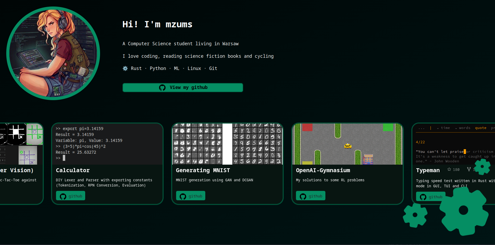
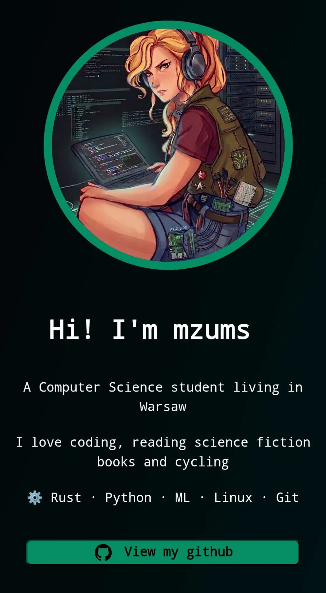

# Personal Website

### built with React + TypeScript + Vite

## See it here: **[mzums.com](https://mzums.com)**

## Desktop view

**_Scroll to make gears spin_**

## Mobile view

 
 

## Info

This page contains two main elements: about me section and a project row.  
The project row infinitely scrolls itself, it stops when you hover it with your cursor.  
On mobile you can also scroll it yourself.  
When you scroll the page, gears spin (they aren't visible on very small windows or on mobile).  
The whole page is very responsive and looks well on every screen.

## Project structure

(apart from default files)

mywebsite  
├── public (some icons)  
└── src  
│    ├── assets  
│    └── components  
│            ├── Card.tsx  
│            ├── CircularImage.tsx  
│            ├── GearIcon.tsx  
│            ├── InfiniteAutoScroll.tsx  
│            └── Typewriter.tsx  
├── App.css  
├── App.tsx  
├── index.css  
├── main.tsx  
├── index.html  
├── package.json  
├── README.md  
├── tsconfig.json  
└── vite.config.json
